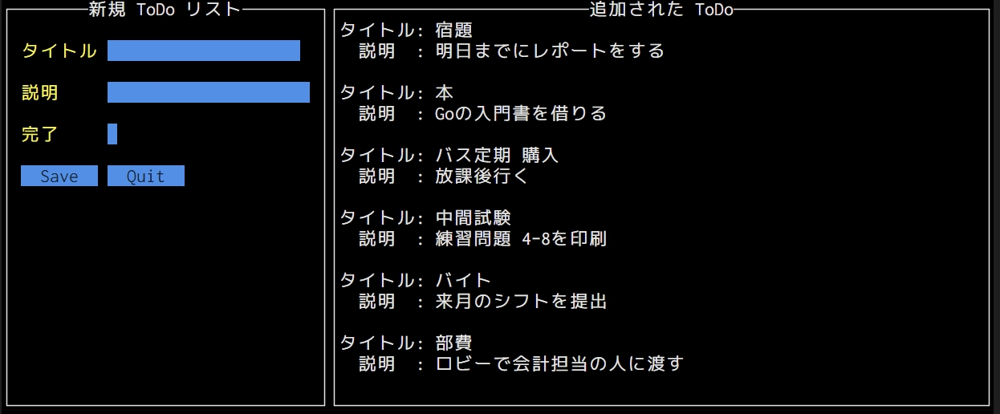

# ToDo-list-tui



## 内容

- Go 言語を使用
- TUI ライブラリである [tview](https://github.com/rivo/tview) を使用しています
- 未完成でコードも汚いです

## 開発期間

2022 8/7 ~ 8/10

## 使い方

```bash
go mod init sample
```

```bash
go mod tidy
```

```bash
go run main.go
```

## 参考にした記事

- [APG4b](https://atcoder.jp/contests/APG4b)
- [A Tour of Go](https://go-tour-jp.appspot.com/list)
- [【Go】tview による TUI ツール作成](https://zenn.dev/minefuto/articles/cafc02dd63f65d)
